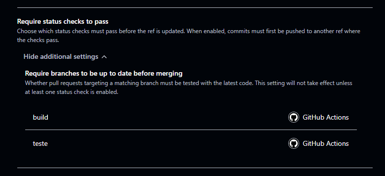
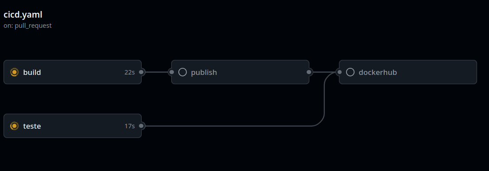

# CriptoTrabalhoFinalInfraestrutura

Integrantes: Lucas Parisotto, Augusto Klug, Thiago Jung, Thyago Floriano, Lauro Pereira Neto Schautica, André Victor Duarte Zeni

Esta API é uma solução robusta para monitoramento de dados do mercado de criptoativos, integrando-se diretamente com a API da Binance para fornecer informações em tempo real sobre preços, trades recentes e cotações de referência.

### Como rodar utilizando Docker
Nosso serviço depende de duas imagens, a da nossa própria API e do SQL Server.

#### Opção sem clonar o repositório completo:
Copiar o arquivo `docker-compose.yaml`, colar em alguma pasta vazia no seu PC, criar um arquivo `.env` com as seguintes variáveis:
`DB_PASSWORD="SuaSenha"`<br>
`DOCKER_IMAGE=thiagojm23/trabalho-cripto-final-infraestrutura:latest` - Imagem da API pública no docker hub

   ```bash
   docker compose up --build
   ```
A API estará disponível em `http://localhost:8080/scalar/v1`.

#### Rodando com o repositório clonado:
Segue o mesmo fluxo que o exemplo de cima, única diferença é que você terá o código inteiro do projeto baixado.

Obs: O `.env` deve estar na raiz do projeto. No mesmo nível do arquivo `docker-compose.yml`

## Stack utilizada

- **Back-end:** API desenvolvida em **ASP.NET Core (.NET 10)**, organizada em camadas de controllers, services, repositories e integração externa.
- **Banco de dados:** **SQL Server** para persistência dos logs de operações, com acesso via **Entity Framework Core** e controle de schema por migrations.
- **Integração externa:** consumo da API da **Binance** via `HttpClient` para consulta de preços, trades recentes e cotações de referência.
- **Containerização:** uso de **Docker** e **Docker Compose** para subir a API e o banco de dados de forma padronizada.
- **Testes e documentação:** testes automatizados com **xUnit** e **Moq**, além da documentação interativa da API com **OpenAPI/Scalar**.

## 🚀 O que a API faz?

- **Monitoramento de Preços:** Consulta o preço atual de qualquer par de ativos (ex: BTCUSDT).
- **Histórico de Negociações:** Recupera os trades mais recentes executados no mercado.
- **Preços de Referência:** Fornece cotações de referência para análise de mercado.
- **Log de Operações:** Sistema interno de persistência para auditoria de consultas realizadas.

---

## 🏗️ Arquitetura e Camadas

O projeto segue os princípios de separação de responsabilidades para facilitar a manutenção e testabilidade:

1. **Controllers:** Porta de entrada da API. Validam as requisições (`ModelState`) e gerenciam os retornos HTTP.
2. **Services:** Contêm a lógica de negócio e orquestram a comunicação entre a integração externa e o repositório.
3. **Integracao (Binance):** Camada de infraestrutura responsável pela comunicação direta com a API externa via `HttpClient`.
4. **Repositories:** Camada de acesso a dados (Entity Framework Core) para persistência dos logs.
5. **DTOs/Entities:** Objetos de transferência de dados e entidades do banco de dados.

---

## 🔐 Segurança e Configurações Sensíveis

### Por que nunca devemos commitar credenciais?
O commit de senhas, chaves de API ou strings de conexão no código-fonte expõe o sistema a ataques graves. Uma vez no histórico do Git, a informação é difícil de remover totalmente. Por isso, este projeto utiliza:
- **Variáveis de Ambiente:** Para configurações dinâmicas e sensíveis.
- **GitHub Secrets:** No fluxo de CI/CD para proteger credenciais em ambientes de automação.
- **.gitignore:** Configurado para nunca subir arquivos `.env`.

### Configuração das Variáveis de Ambiente

1. Copie o arquivo `.env.example` para um novo arquivo chamado `.env`:
   ```bash
   cp .env.example .env
   ```
2. No arquivo `.env`, defina a variável `DB_PASSWORD` e `DOCKER_IMAGE`.

---
## 📋 Relatório

### 3. O que acontece se um teste falhar propositalmente?

Para validar o comportamento da pipeline de CI/CD diante de falhas, foi realizado um teste através do **Pull Request #9** (`TJ:develop: Teste para CI barrar MR`)

**O que foi feito:**
Foi introduzido um erro de sintaxe proposital no arquivo `Controllers/LogsController.cs` quebrando a compilação do projeto.

**O que aconteceu:**
Ao abrir o PR, a pipeline `CI/CD Pipeline` foi disparada automaticamente (run #12). O job `build-and-test` falhou na compilação detectados pelo `dotnet build`:

- `Identifier expected`
- `Syntax error, ',' expected`
- `Process completed with exit code 1`

O PR ficou com o check da pipeline marcado como **falho**, sinalizando claramente que o código não está apto para merge. O merge pôde ser bloqueado pela proteção de branch configurada, impedindo que código quebrado chegasse à branch principal.

---

#### 4. Por que nunca devemos commitar credenciais no código?

Commitar senhas, strings de conexão ou chaves de API no repositório representa um risco grave de segurança pelos seguintes motivos:

- **O histórico do Git é permanente:** mesmo que a credencial seja removida em um commit posterior, ela continua acessível via `git log` ou ferramentas de busca em histórico.
- **Repositórios públicos expõem instantaneamente:** bots varrem o GitHub continuamente em busca de credenciais expostas. Uma chave vazada pode ser explorada em minutos.
- **Repositórios privados também oferecem risco:** qualquer pessoa com acesso ao repositório passa a ter acesso às credenciais de produção, mesmo que não precise delas..

A solução adotada neste projeto — variáveis de ambiente localmente via `.env` e GitHub Secrets na pipeline.

---

#### 5. Em que cenário real isso seria útil?

- **Entrega entre times:** o time de infraestrutura pode baixar o binário gerado pelo
time de desenvolvimento e fazer o deploy manualmente em um servidor, sem precisar buildar
o projeto localmente nem ter acesso ao código-fonte.

- **Rastreabilidade de versões:** é possível associar exatamente qual binário foi gerado
a partir de qual commit, facilitando auditorias e rollbacks. Se um bug aparecer em
produção, basta identificar o run correspondente e baixar o artefato daquele momento.

- **Ambientes sem acesso ao repositório:** servidores de produção frequentemente não
têm acesso ao código-fonte por questões de segurança. O artefato publicado resolve
esse problema, entregando apenas o necessário para executar a aplicação.

---
### 6. Qual versão apresentou alguma diferença de comportamento, se houver?

Foi adicionada a `strategy.matrix` no job `teste` para executar em duas versões do .NET simultaneamente. O resultado observado foi: 

CI/CD Pipeline / build (pull_request) ❌ Failing after 19s 
CI/CD Pipeline / teste (9.0.x) ❌ Failing after 17s 

O job `teste (9.0.x)` falhou no passo **Restore dependencies** com erro `NU1202`, pois os pacotes do Entity Framework Core 10.0.7 utilizados no projeto são compatíveis apenas com `net10.0`, sendo rejeitados pelo `dotnet restore` ao tentar rodar em `net9.0`. O job `teste (10.0.x)` foi cancelado como consequência da falha no `build`. 

A matriz cumpriu seu papel: evidenciou de forma automatizada que o projeto é compatível apenas com .NET 10, resultado que sem a pipeline só seria descoberto manualmente. 

---

### 7.  Documente com print do painel de configuração no relatório



---

### 8. Por que paralelismo importa em pipelines de CI?

Em pipelines sequenciais, cada job aguarda o anterior terminar antes de iniciar.
Com paralelismo, múltiplos jobs rodam ao mesmo tempo, reduzindo drasticamente o
tempo total de feedback para o desenvolvedor.

No projeto, os jobs `build`, `teste` e `publish` são um exemplo prático disso:
`build` e `teste` rodam em paralelo (nenhum depende do outro), enquanto `publish`
aguarda o `build` com `needs: build`. Isso significa que o tempo total da pipeline
não é a soma dos três jobs, mas sim o maior tempo entre `build` e `teste` somado
ao tempo do `publish`.

Com a matriz de versões da Tarefa 6, o paralelismo fica ainda mais evidente:
os jobs `teste (8.0.x)` e `teste (10.0.x)` rodam simultaneamente — se fossem
sequenciais, o tempo dobraria a cada versão adicionada.

Nosso CI/CD:



---

### 9. Diferença entre tag `latest` e tag por SHA

Ao referenciar actions no workflow (ex: `actions/checkout`), é possível fixar
a versão de três formas diferentes:

| Forma | Exemplo | Comportamento |
|---|---|---|
| Tag `latest` | `actions/checkout@latest` | Sempre usa a versão mais recente |
| Tag semântica | `actions/checkout@v4` | Usa a versão major fixada |
| SHA do commit | `actions/checkout@11bd71901bbe5b1630ceea73d27597364c9af683` | Usa exatamente aquele commit, imutável |

#### Tag `latest` ou tag semântica (ex: `@v4`)

Mais prática e fácil de manter. O problema é que o conteúdo pode mudar sem que
o workflow mude — uma atualização da action pode introduzir comportamentos
diferentes ou quebrar a pipeline silenciosamente. Para projetos acadêmicos ou
ambientes de desenvolvimento, é a escolha mais comum e suficiente.

#### Tag por SHA

Aponta para um commit específico e imutável no repositório da action. Mesmo que
o mantenedor publique uma nova versão ou, em um cenário malicioso, sobrescreva
uma tag existente, o workflow continuará executando exatamente o mesmo código
que foi auditado e aprovado.

#### Quando usar cada uma?

- **Tag semântica (`@v4`):** uso geral, projetos internos, ambientes de desenvolvimento.
Boa prática de manutenção sem abrir mão de segurança razoável.

- **SHA fixo:** ambientes de produção, pipelines que lidam com secrets sensíveis,
projetos que seguem padrões de segurança rigorosos (ex: SOC 2, ISO 27001). É a
recomendação oficial do GitHub para workflows que acessam credenciais críticas,
pois elimina o risco de supply chain attacks — ataques onde um pacote ou
dependência é comprometido para injetar código malicioso na pipeline.
